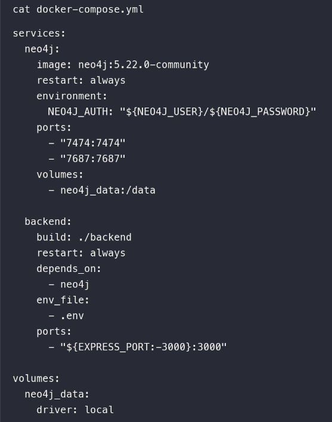
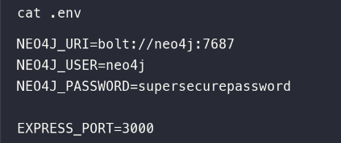
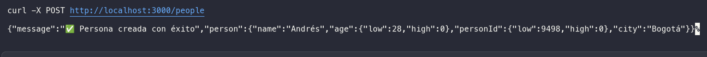
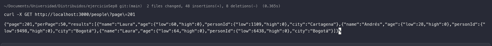

# Se eliminó el network creado:
 docker-compose sin el network

# Conexión por medio del nombre del servicio:

# Prueba del metodo post
 

# Prueba del metodo get

# Utilizando un user-defined network